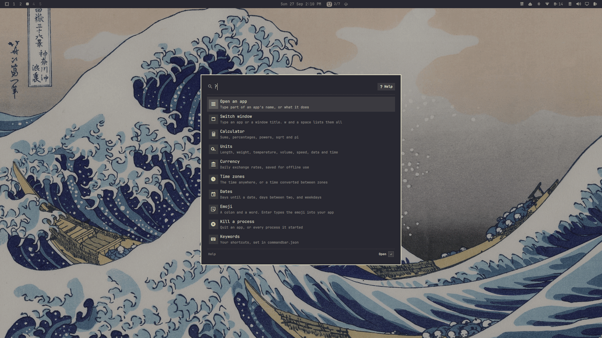
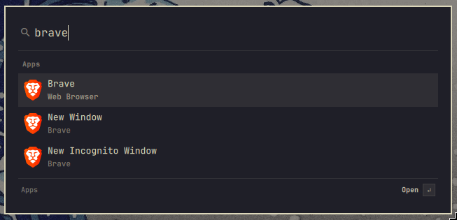
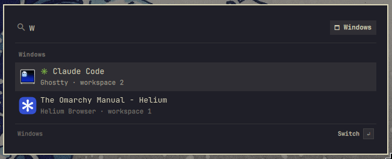
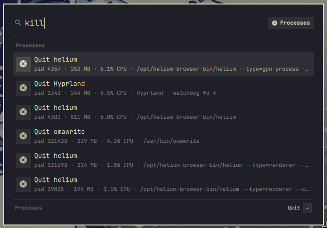

# Command Bar

Spotlight-style command bar - app launcher, calculator, currency, time zones, date maths, emoji, kill process, ask your AI agent and your own keyword commands



<p align="center">
  <b>Open an app</b><br>
  
</p>

<p align="center">
  <b>Switch window</b><br>
  
</p>

<p align="center">
  <b>Kill a process</b><br>
  
</p>

## What it does

| Type | Result |
|------|--------|
| `12*8 + 15%`, `sqrt(2)`, `15% of 200`, `5!` | Calculator |
| `100 usd to eur`, `$50`, `50 gbp`, `usd jpy` | Currency conversion, using rates from [open.er-api.com](https://open.er-api.com) |
| `time`, `time in tokyo`, `3pm cet to pst` | Time zones |
| `days until dec 25`, `today + 45 days`, `next friday` | Date calculations |
| `:fire`, `emoji party` | Emoji search. Enter types the emoji into the app you were using and copies it |
| `5 km to mi`, `72f`, `5 ft 11 in to cm`, `2 cups in ml` | Unit conversion: length, weight, temperature, volume, area, speed, data and time. Offline |
| `brave`, `netflix`, `w `, `w github` | Switch to an open window, found by its app or its title. `w ` lists them all, most recent first |
| `firefox`, `term`, `vsc`, `brave new window` | Open an installed app, or one of its actions like New Window. Only apps: nothing here changes a setting or a default |
| `kill`, `kill chrome`, `kill -9 node` | Quit one of your processes, or all processes with that name |
| `ai why is my wifi slow` | Open Omarchy's default agent (`omarchy default agent`) in a terminal with that prompt, or ChatGPT or Claude in your browser. |
| `g …`, `yt …`, `gh …`, `wiki …`, `lock` | Keyword commands, which you can change in the config |

Type part of a feature's name to find it. `emo` finds Search emoji and `curr` finds Convert currency.

Type `?` for help. It lists one topic per feature. Enter opens a topic, and each example in it shows the answer it would give, so `5 km to mi` reads `→ 3.1069 mi`. Enter on an example tries it. Esc goes back to the topics. Type words after the `?` to search the help, for example `?money`.

Results come in groups (Windows, Apps, Calculator and so on). A sum or a conversion at the top shows in large type. The footer names the selected row's group and what Enter will do with it, such as Open, Switch or Copy.

Keys:

- Up/Down or Ctrl+N/P moves the selection.
- Enter copies, opens or runs the selected row.
- Alt+1 to Alt+9 copy, open or run that row straight away. Each of the first nine rows shows its key. The `?` help has no shortcuts.
- Tab fills in the query for the selected row, for example a keyword and a space.
- Esc clears the text. Press it again to close the bar.

After you copy, open or run something, the bar starts empty next time. If you close it without doing anything (Esc or clicking outside), it keeps your text, selected, so typing replaces it.

## Install

```sh
omarchy plugin add https://github.com/Saikomantisu/omarchy-commandbar --enable
```

Press Super + Period to open it. You can change the key with `"hotkey"` in the config. If another action already uses the key, the bar leaves it alone and shows a notification.

To open the bar with text already filled in, pass a query. For example, to open emoji search directly:

```sh
omarchy-shell shell toggle io.github.saikomantisu.commandbar '{"query": ":"}'
```

### Dependencies

All of these come with Omarchy:

- `curl`: exchange rates
- `wl-copy` (from `wl-clipboard`): copying results
- `xdg-open`: web keyword commands
- `ps` and `kill` (from `procps-ng`): the process list
- `date` and `timedatectl`: time zones
- `uwsm-app` and `gtk-launch`: opening apps, the same way Omarchy's own launcher does
- `hyprctl`: setting the hotkey, and listing and focusing windows
- `notify-send`: warning when the hotkey is already taken
- `python3`: reading and writing the cache files safely (`bin/commandbar-cache`)
- `omarchy-menu-emoji-insert` and Omarchy's `emojis.json`: emoji
- `omarchy-default-agent`, `omarchy-cmd-missing`, `omarchy-agent-prompt` and `omarchy-agent --pick`: asking your agent (`bin/commandbar-agent`)

### Network, files and processes

- The only network request is to `https://open.er-api.com/v6/latest/USD`, made when you convert currency and the saved rates are out of date. The rates update once a day. What you type is not sent anywhere, except the text you search with a web keyword like `g` and the prompt you give your agent with `ai`.
- It writes only to `~/.cache/omarchy-commandbar/`: the saved rates, your last query, and how often you've opened each app from the bar (used to order equally good matches). It does not change your Hyprland or Omarchy config files.
- The cache files are read and written only through `bin/commandbar-cache`. It refuses symlinks, hard links, files you don't own and files over a size limit (4 KiB for the last query, 64 KiB for app counts, 256 KiB for rates), and saves each file through a private temporary file.
- It sets its hotkey in the running Hyprland with `hyprctl eval`, and sets it again after Hyprland reloads its config. The hotkey is removed when the plugin is disabled or removed.
- It lists only your own processes, and quits one only when you press Enter on it.
- It asks `omarchy-default-agent` for your default agent each time it opens, reading at most 64 bytes of the answer, and starts that agent only when you press Enter on an `ai` row. The bar itself sends nothing to an AI service; the agent does, as it would if you started it yourself.

## Remove

```sh
omarchy plugin remove io.github.saikomantisu.commandbar
rm -rf ~/.cache/omarchy-commandbar ~/.config/omarchy/extensions/commandbar.json
```

The hotkey is removed with the plugin.

## Configure

Put your settings in `~/.config/omarchy/extensions/commandbar.json`. They override the defaults in [`config.default.json`](config.default.json), and changes apply when you save. You can use comments and trailing commas.

```jsonc
{
  // A Hyprland key combination. "" means no hotkey.
  "hotkey": "SUPER + PERIOD",
  // Features to turn on. When results score equally, earlier ones come first.
  "providers": ["commands", "math", "currency", "time", "emoji", "processes", "units", "windows", "apps", "ai"],
  // Default home currency is USD.
  "currency": { "home": "EUR", "favorites": ["USD", "GBP"] },
  // Default home zone is your system time zone.
  "time": { "home": "Europe/Berlin", "zones": ["UTC", "America/New_York"], "clock24": true },
  // "paste" types the emoji into the app you were using and copies it; "copy" only copies it.
  "emoji": { "onEnter": "paste" },
  // Asking your agent. See "Asking your agent" below.
  "ai": { "keyword": "ai", "fallback": false, "chats": [{ "title": "ChatGPT", "open": "https://chatgpt.com/?q={q}" }] },
  // This list replaces the default keyword commands.
  "commands": [
    { "keyword": "g", "title": "Search Google", "open": "https://www.google.com/search?q={q}" },
    { "keyword": "ddg", "title": "DuckDuckGo", "open": "https://duckduckgo.com/?q={q}" },
    { "keyword": "term", "title": "Terminal", "run": "xdg-terminal-exec" },
    { "keyword": "say", "title": "Notify", "run": "notify-send {q}" }
  ]
}
```

`{q}` is whatever you type after the keyword. In `open` commands it is URL-encoded. In `run` commands it is shell-quoted, so it can't change the command itself.

## Asking your agent

`ai <prompt>` hands your prompt to `omarchy agent prompt`, which opens the agent you picked with `omarchy default agent` in a terminal, the way the Super + Shift + Ctrl + A key does. If you haven't picked one, Enter opens Omarchy's agent menu instead. Omarchy installs an agent when you pick it. If it has been removed since, a notification says so and how to install it again.

Omarchy starts every agent with its auto-approve setting (`claude --permission-mode auto`, `codex --approve-for-me`, `gemini --yolo` and so on), so the agent runs commands without asking. The row says so before you press Enter.

| Setting | Default | What it does |
|---|---|---|
| `keyword` | `"ai"` | The word that starts a prompt. A keyword command with the same word takes it over |
| `fallback` | `false` | `true` offers the agent and the chat websites when a query of two words or more matches nothing else, as if you had typed `ai` first. Enter on a mistyped query then starts the agent |
| `chats` | ChatGPT, Claude | Chat websites listed under the agent. `{q}` is the prompt, URL-encoded. `[]` hides them |

Under the agent, a "Chat websites" section lists each site, so Alt+2 and Alt+3 open the prompt in ChatGPT or Claude instead. Add others, such as Perplexity (`https://www.perplexity.ai/search?q={q}`), to the list. Opening one sends your prompt to that site, the same as a web keyword.

## Adding a feature

Each feature is a JavaScript file in `providers/`:

```js
.pragma library

var provider = {
  id: "units",
  name: "Units",
  icon: "󰕒",
  // Found by name: typing "unit" shows this command.
  commands: [{ title: "Convert Units", keywords: "unit convert", text: "e.g. 5 km to mi", complete: "5 km to mi", select: true }],
  // Shown in the "?" list.
  help: [{ title: "Units", examples: ["5 km to mi", "30c to f"] }],
  // Return [] if the query isn't for this feature.
  match: function(query, ctx) {
    return [{ title: "3.11 mi", subtitle: "5 km → mi", score: 80, copy: "3.11" }]
  }
}
```

A result can include `run: { kind: "open" | "run", target }` to open or run something on Enter, `group` to list it under its own heading instead of the feature's name, and `fallback: true` to show it only when no other result does. `ctx.settings` is the provider's section of the config. `ctx` also has `rates`, `zones`, `localZone`, `emojis`, `processes`, `now()`, `format(n)` and `plain(n)`.

To enable it, import it in [`providers/index.js`](providers/index.js), add it to the list there, and add its `id` to `"providers"` in the config.

Test providers without the shell by running `node tests/run.js`.

To contribute, see [CONTRIBUTING.md](CONTRIBUTING.md).

## License

MIT
